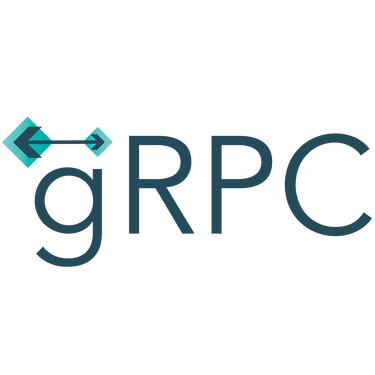

In this blog post, I'm going to create a [gRPC](https://grpc.io/) microservice using
[NestJS](https://nestjs.com/).

### What is gRPC?

gRPC is an open source [Remote Procedure Call](https://en.wikipedia.org/wiki/Remote_procedure_call)
developed by Google in 2015. It uses HTTP/2 for transport and [Protocol Buffers](https://developers.google.com/protocol-buffers)
to encode the data, which have a stricter specification compared with JSON. It is language-neutral
and platform-neutral so it can run in any environment.

### Pre-requisites

Before you begin, make sure that you have NestJS installed on your machine.

### Creating the Services

We will start by creating 2 different services.

#### Hello World Service

The first service that we're going to create is `Hello World Service`. This is just going to be a
simple service that returns `Hello World!` upon called.

Create a new NestJS project called `hello-world-service`.

```bash noLineNumbers
$ nest new hello-world-service
```

Install the required packages.

```bash noLineNumbers
$ npm i @nestjs/microservices grpc @grpc/proto-loader
```

Create a `.proto` file to define your protobuf.

```:title=src/protos/hello-world.proto
syntax = "proto3";

package hello;

service HelloWorldService {
  rpc GetHelloWorld (HelloWorldReq) returns (HelloWorld) {}
}

message HelloWorldReq {}

message HelloWorld {
  string reply = 1;
}
```

Update your `main.ts` file to this:

```ts:title=main.ts
import { Logger } from '@nestjs/common';
import { NestFactory } from '@nestjs/core';
import { MicroserviceOptions, Transport } from '@nestjs/microservices';
import { join } from 'path';
import { AppModule } from './app.module';

const logger = new Logger();

async function bootstrap() {
  const app = await NestFactory.createMicroservice<MicroserviceOptions>(AppModule, {
    transport: Transport.GRPC,
    options: {
      package: 'hello',
      protoPath: join(__dirname, './protos/hello-world.proto'),
    },
  });
  await app.listen(() => logger.log('Hello World service is listening...'));
}
bootstrap();
```

Update your `app.controller.ts` to this:

```ts:title=app.controller.ts
import { Controller } from '@nestjs/common';
import { GrpcMethod } from '@nestjs/microservices';

@Controller()
export class AppController {
  @GrpcMethod('HelloWorldService', 'GetHelloWorld')
  getHelloWorld() {
    return { reply: 'Hello World!'};
  }
}
```

Note that we're using `@GrpcMethod()` decorator in our controller to tell NestJS that this method
is a gRPC service method. The first argument in the decorator denotes our service name which we
defined in our `hello-world.proto` file while the second argument denotes our RPC method within
`HelloWorldService` in the `hello-world.proto` file.

#### Custom Hello Service

The second service that we're going to create is `Custom Hello Service`. This is just going to be a
simple service that accept a string as `params` and returns `Hello <params>!` upon called. We will
repeat several steps from the `Hello World Service` above.

Create a new NestJS project called `custom-hello-service`.

```bash noLineNumbers
$ nest new custom-hello-service
```

Install the required packages.

```bash noLineNumbers
$ npm i @nestjs/microservices grpc @grpc/proto-loader
```

Create a `.proto` file to define your protobuf.

```:title=src/protos/custom-hello.proto
syntax = "proto3";

package customHello;

service CustomHelloService {
  rpc GetCustomHello (CustomHelloReq) returns (CustomHello) {}
}

message CustomHelloReq {
  string data = 1;
}

message CustomHello {
  string reply = 1;
}
```

Update your `main.ts` file to this:

```ts:title=main.ts
import { Logger } from '@nestjs/common';
import { NestFactory } from '@nestjs/core';
import { MicroserviceOptions, Transport } from '@nestjs/microservices';
import { join } from 'path';
import { AppModule } from './app.module';

const logger = new Logger();

async function bootstrap() {
  const app = await NestFactory.createMicroservice<MicroserviceOptions>(AppModule, {
    transport: Transport.GRPC,
    options: {
      package: 'customHello',
      protoPath: join(__dirname, './protos/custom-hello.proto'),
    },
  });
  await app.listen(() => logger.log('Custom Hello service is listening...'));
}
bootstrap();
```

Update your `app.controller.ts` to this:

```ts:title=app.controller.ts
import { Controller } from '@nestjs/common';
import { GrpcMethod } from '@nestjs/microservices';

@Controller()
export class AppController {
  @GrpcMethod('CustomHelloService', 'GetCustomHello')
  getCustomHello(data: string) {
    return { reply: `Hello ${data}!` };
  }
}
```

Same as the previous `Hello World Service`, the first parameter in `@GrpcMethod()` decorator
denotes our service name which we defined in our `custom-hello.proto` file while the second
argument denotes our RPC method within `CustomHelloService` in the `custom-hello.proto` file.

#### API Gateway

API gateway is a server that act as the single entry point to our system. It encapsulates internal
system architecture and provides an API that is tailored to each client. Basically, API gateway is
the one that is going to expose our microservices to the outside world.

Create a new NestJS project called `api-gateway`.

```bash noLineNumbers
$ nest new api-gateway
```

Install the required packages.

```bash noLineNumbers
$ npm i @nestjs/microservices grpc @grpc/proto-loader
```

Copy the `.proto` files from the previous services into `src/protos` folder.

Update your `app.controller.ts` file to this:

```ts:title=app.controller.ts
import { Controller, Get, Param, Query } from '@nestjs/common';
import { AppService } from './app.service';

@Controller()
export class AppController {
  constructor(private readonly appService: AppService) {}

  @Get('hello-world')
  getHelloWorld() {
    return this.appService.getHelloWorld();
  }

  @Get('custom-hello')
  getCustomHello(@Query('q') q: string) {
    return this.appService.getCustomHello(q);
  }
}
```

Update your `app.service.ts` file to this:

```ts:title=app.service.ts
import { Injectable, OnModuleInit, Inject } from '@nestjs/common';
import { ClientGrpc } from '@nestjs/microservices';
import { Observable } from 'rxjs';

interface HelloWorldService {
  getHelloWorld(data: any): Observable<any>;
}

interface CustomHelloService {
  getCustomHello(data: any): Observable<any>;
}

@Injectable()
export class AppService implements OnModuleInit {
  private helloWorldService: HelloWorldService;
  private customHelloService: CustomHelloService;

  constructor(
    @Inject('HELLO_WORLD_SERVICE') private helloWorldClient: ClientGrpc,
    @Inject('CUSTOM_HELLO_SERVICE') private customHelloClient: ClientGrpc
  ) {}

  onModuleInit() {
    this.helloWorldService = this.helloWorldClient.getService<HelloWorldService>('HelloWorldService');
    this.customHelloService = this.customHelloClient.getService<CustomHelloService>('CustomHelloService');
  }

  getHelloWorld() {
    return this.helloWorldService.getHelloWorld({});
  }

  getCustomHello(data: string) {
    return this.customHelloService.getCustomHello({ data });
  }
}
```

Lastly, update your `app.module.ts` file to this:

```ts:title=app.module.ts
import { Module } from '@nestjs/common';
import { ClientsModule, Transport } from '@nestjs/microservices';
import { join } from 'path';
import { AppController } from './app.controller';
import { AppService } from './app.service';

@Module({
  imports: [ClientsModule.register([
    {
      name: 'HELLO_WORLD_SERVICE',
      transport: Transport.GRPC,
      options: {
        package: 'hello',
        protoPath: join(__dirname, './protos/hello-world.proto'),
      },
    },
    {
      name: 'CUSTOM_HELLO_SERVICE',
      transport: Transport.GRPC,
      options: {
        package: 'customHello',
        protoPath: join(__dirname, './protos/custom-hello.proto'),
      },
    },
  ]),],
  controllers: [AppController],
  providers: [AppService],
})
export class AppModule {}
```

### Testing the Services

To test the microservices, you can use [Postman](https://www.postman.com/) or [cURL](https://curl.haxx.se/)
and do a `GET` method to `localhost:3000/hello-world` to test the `Hello World Service` and
`localhost:3000/custom-hello?q={query}` to test the `Custom Hello Service`.

You can see the full source code [here](https://github.com/vferdiansyah/nestjs-grpc-microservices).
